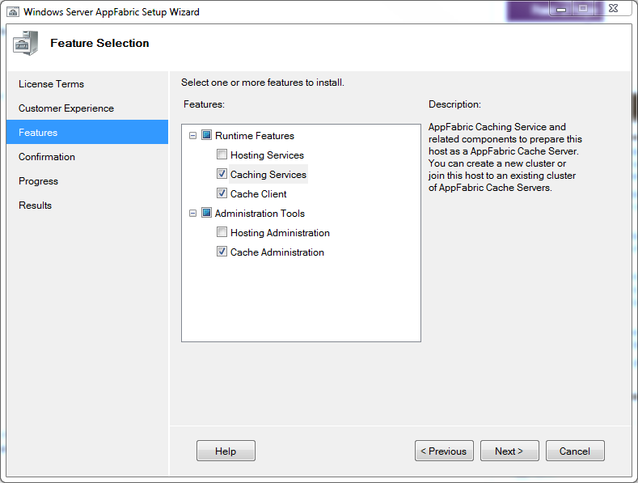
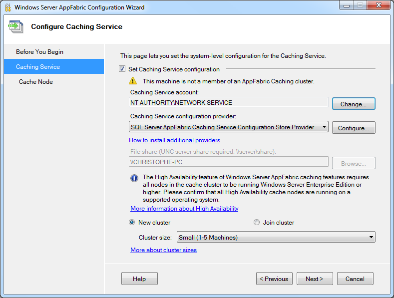
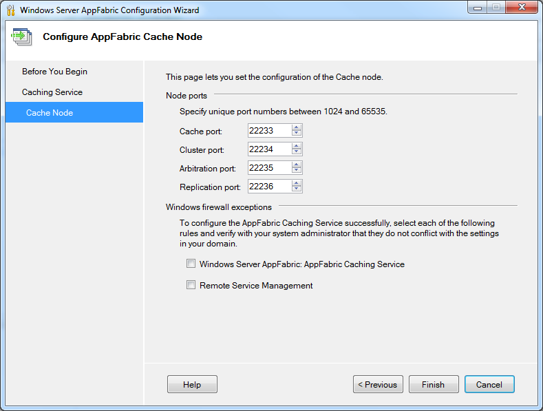
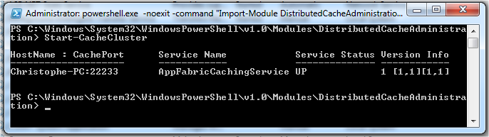
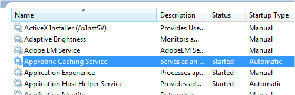
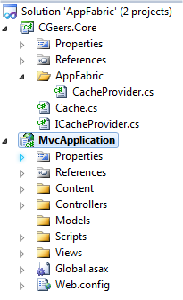
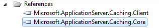

# Windows Server AppFabric Caching

## Introduction

For those of you who haven't heard about AppFabric yet, check out the [Windows Server AppFabric Learning Center](http://msdn.microsoft.com/en-us/windowsserver/ee695849.aspx) on MSDN. The first version is out now and can be downloaded [here](http://www.microsoft.com/downloads/details.aspx?FamilyID=467E5AA5-C25B-4C80-A6D2-9F8FB0F337D2&displaylang=en).

One key functionality of AppFabric that caught my attention was its caching feature also known as Velocity (Project Code Name). To quote MSDN:

"_For Web applications, AppFabric provides caching capabilities to provide high-speed access, scale, and high availability to application data._"

Sounds interesting, especially as I am building a web application which is going to be hosted in a web farm. Instead of using ASP.NET's built-in caching option, which is tied to a single AppDomain and thus one web server, I can opt to use a cache powered by AppFabric which is shared across web servers.

Let's see it in action...

## Installation

Lets first install AppFabric. Download the most appropriate Windows Server AppFabric version for you on the following page:

[http://www.microsoft.com/downloads/details.aspx?FamilyID=467E5AA5-C25B-4C80-A6D2-9F8FB0F337D2&displaylang=en](http://www.microsoft.com/downloads/details.aspx?FamilyID=467E5AA5-C25B-4C80-A6D2-9F8FB0F337D2&displaylang=en)

Start and follow the wizard. First it will ask which features you want to install. I'm only interested in the caching features so I unchecked all the rest.

**Figure 1** - Feature Selection



Next you need to configure the Caching Service.

**Figure 2** - Configure Caching Service



I created a new local user account for the Caching Service account (default: NT AUTHORITY\\NETWORK SERVICE) and chose to store its configuration settings in an XML file which needs to be located in a file share (UNC server share: e.g.:\\\\CHRISTOPHE-PC\\AppFabric).

**Remark**: You can also opt to store the configuration settings in an SQL Server database, but alas this is only allowed if you are part of a domain and not a workgroup. So I'm stuck with the XML option since I'm using Windows 7 Home Premium.

You can also change the default ports for the Cache node, but I used the default values.

**Figure 3** - Configure AppFabric Cache Node.



Be sure to include the Windows firewall exceptions if needed!

**Remark**: Also check out [Scott Hanselman's article](http://www.hanselman.com/blog/InstallingConfiguringAndUsingWindowsServerAppFabricAndTheVelocityMemoryCacheIn10Minutes.aspx) which contains more information about setting up AppFabric.

## Administration

When administrating AppFabric Caching you'll have to do most of it using a command-line tool.

**Figure 4** - Caching Administration Windows PowerShell


Run it as Administrator and type "Start-CacheCluster" to start the AppFabric Caching Service.

**Figure 5** - Starting The Cache Cluster



Afterwards I changed the startup type of the service to automatic via the MMC Services add-in.

**Figure 6** - Services



You can also download the [AppFabric Caching Administration Tool](http://mdcadmintool.codeplex.com/) by Ron Jacobs on CodePlex if you prefer a graphical user interface to perform most of the regular tasks when it comes to administrating the Microsoft Distributed Cache.

## Using The Cache in ASP.NET MVC

I created a blank solution in Visual Studio 2010 called AppFabric. The solution contains two projects, namely a class library (CGeers.Core) and a MVC 2 Web Application (MvcApplication).

**Figure 7** - Solution Explorer



The CGeers.Core class library contains references to two assemblies from AppFabric.

**Figure 8** - AppFabric Assemblies



I don't want to directly use the AppFabric types in my MVC application so I added the following interface to the CGeers.Core library.

**Listing 1** - ICacheProvider

```csharp
public interface ICacheProvider
{
    void Add(string key, object value);
    void Add(string key, object value, TimeSpan timeout);
    object Get(string key);
    object this[string key] { get; set; }
    bool Remove(string key);
}
```

When I want to add / retrieve an object to / from the cache I use the methods of the static Cache type shown in Listing 2. Internally these methods use an implementation of the ICacheProvider interface and delegate all calls to that instance. The ICacheProvider instance is resolved using the ServiceLocator type provided by [Unity 2.0](http://unity.codeplex.com/).

**Update 15.09.2011**: Please check out the following [StackOverflow question](http://stackoverflow.com/questions/5751420/net-mvc3-service-locator-dependency-resolver-question-with-ninject). It suggests a better approach of resolving an ICacheProvider implementation instead of using a static class as suggested here. I basically went for ease of use here (just use the Cache type), but it's not very flexible if you want to change to another ICacheProvider. The approach suggested in the SO post also avoids having a dependency on the ServiceLocator and Cache types.

**Listing 2** - Cache

```csharp
public static class Cache
{
    private static readonly ICacheProvider CacheProvider;

    static Cache()
    {
        CacheProvider =
            (ICacheProvider) ServiceLocator.Current
                                    .GetInstance(typeof (ICacheProvider));
    }

    public static void Add(string key, object value)
    {
        CacheProvider.Add(key, value);
    }

    public static void Add(string key, object value, TimeSpan timeout)
    {
        CacheProvider.Add(key, value, timeout);
    }

    public static object Get(string key)
    {
        return CacheProvider[key];
    }

    public static bool Remove(string key)
    {
        return CacheProvider.Remove(key);
    }
}
```

Now we only need to create an ICacheProvider implementation for AppFabric. The following listing shows you how to do this.

**Listing 3** - AppFabric CacheProvider Implementation

```csharp
public class CacheProvider : ICacheProvider
{
    private static DataCacheFactory _factory;
    private static DataCache _cache;

    private static DataCache GetCache()
    {
        // ...
    }

    public void Add(string key, object value)
    {
        var cache = GetCache();
        cache.Add(key, value);
    }

    public void Add(string key, object value, TimeSpan timeout)
    {
        var cache = GetCache();
        cache.Add(key, value, timeout);
    }

    public object Get(string key)
    {
        var cache = GetCache();
        return cache.Get(key);
    }

    public object this[string key]
    {
        get { return this.Get(key); }
        set
        {
            var cache = GetCache();
            cache.Put(key, value);
        }
    }

    public bool Remove(string key)
    {
        var cache = GetCache();
        return cache.Remove(key);
    }
}
```

All of the methods are pretty straightforward. The Add(...), Remove(...)...etc. methods all use the [DataCache class](<http://msdn.microsoft.com/en-us/library/microsoft.applicationserver.caching.datacache(WS.10).aspx>) provided by AppFabric. The GetCache() method configures and sets up your cache.

**Listing 4** - Configuring and Setting Up the Cache

```csharp
private static DataCache GetCache()
{
    if (_cache != null) return _cache;

    // Cache host(s)
    var servers = new List<DataCacheServerEndpoint>(1)
                        {
                            new DataCacheServerEndpoint("localhost", 22233)
                        };

    // Configuration
    var configuration =
        new DataCacheFactoryConfiguration
            {
                Servers = servers,
                LocalCacheProperties =
                    new DataCacheLocalCacheProperties(1000,
                        new TimeSpan(0, 10, 0),
                        DataCacheLocalCacheInvalidationPolicy.TimeoutBased)
            };

    // Disable tracing to avoid informational / verbose messages on the web page
    DataCacheClientLogManager.ChangeLogLevel(TraceLevel.Off);

    _factory = new DataCacheFactory(configuration);
    _cache = _factory.GetCache("default");

    return _cache;
}
```

The code shown in Listing 4 is taken from the code provided by the [Windows Server AppFabric Samples](http://www.microsoft.com/downloads/details.aspx?displaylang=en&FamilyID=db665003-44c5-4e25-9ce1-c53512f24492).

Instead of configuring your cache from code you can also move this to your application's configuration file. Let's move it to the Web.config file. Make sure your web application projects references the assemblies displayed in Figure 8.

**Listing 5** - Web.config

```xml
<configSections>
  <section name="dataCacheClient"
            type="Microsoft.ApplicationServer.Caching.DataCacheClientSection,
                  Microsoft.ApplicationServer.Caching.Core, Version=1.0.0.0,
                  Culture=neutral, PublicKeyToken=31bf3856ad364e35"
            allowLocation="true"
            allowDefinition="Everywhere"/>

  <section name="unity"
            type="Microsoft.Practices.Unity.Configuration.UnityConfigurationSection,
                  Microsoft.Practices.Unity.Configuration" />
</configSections>

<dataCacheClient>
  <localCache isEnabled="true" sync="TimeoutBased" objectCount="1000" ttlValue="600" />
  <hosts>
    <host name="localhost" cachePort="22233" />
  </hosts>
</dataCacheClient>
```

You need to to include the DataCacheClientSection configuration section so that your application can understand and parse the dataCacheClient node of your configuration file. In this node you setup all hosts that make up your cache cluster, configure local caching...etc. You can now reduce the code of Listing 4 to this:

**Listing 6** - Configuring and Setting Up the Cache via Web.config

```csharp
private static DataCache GetCache()
{
    if (_cache != null) return _cache;

    var configuration = new DataCacheFactoryConfiguration();
    _factory = new DataCacheFactory(configuration);
    _cache = _factory.GetCache("default");

    return _cache;
}
```

Add a reference to the CGeers.Core library from the MVC application and you are ready to use the AppFabric Caching service.

**Listing 7** - Adding an Object to the Cache

```csharp
var myIdentifier = (Guid?) Cache.Get("MyIdentifier");
if (myIdentifier == null)
{
    myIdentifier = Guid.NewGuid();
    Cache.Add("MyIdentifier", myIdentifier, new TimeSpan(0, 0, 30));
}
ViewData["MyIdentifier"] = myIdentifier;
```

Don't forget to configure your Unity container so that the ServiceLocator type (see Listing 2) will find the AppFabric implementation of the ICacheProvider interface. You can do this from your Global.asax Application_Start() event handler.

**Listing 8** - UnityContainer

```csharp
protected void Application_Start()
{
    AreaRegistration.RegisterAllAreas();
    RegisterRoutes(RouteTable.Routes);

    var container = new UnityContainer();
    var section = (UnityConfigurationSection) ConfigurationManager.GetSection("unity");
    section.Configure(container, "defaultContainer");

    var serviceLocator = new UnityServiceLocator(container);
    ServiceLocator.SetLocatorProvider(() => serviceLocator);
}
```

**Remark**: The contents of the UnityContainer are configured in the Web.config. Download the source code for this article if you want to check it out.

## ASP.NET Session State Provider

In ASP.NET you have 4 options when choosing which provider to use for your session state, namely:

- In-Process (default)
- ASP.NET State Service
- SQL Server Mode
- Custom

AppFabric provides a custom session state provider that allows you to store your session state in the AppFabric cache. You only need to expand the configuration shown in Listing 5 with the following which needs to be placed within the system.web node.

**Listing 9** - Session State Provider

```xml
<sessionState mode="Custom" customProvider="AppFabricCacheSessionStoreProvider">
  <providers>
    <add
      name="AppFabricCacheSessionStoreProvider"
      type="Microsoft.ApplicationServer.Caching.DataCacheSessionStoreProvider"
      cacheName="default"
      sharedId="MvcApplication"/>
  </providers>
</sessionState>
```

Voila, your session state is now maintained by Windows Server AppFabric. Check out the following MSDN article for more information about configuring an ASP.NET Session State Provider for AppFabric:

[http://msdn.microsoft.com/en-us/library/ee790859.aspx](http://msdn.microsoft.com/en-us/library/ee790859.aspx)
